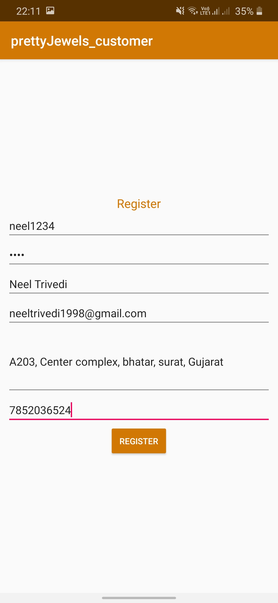
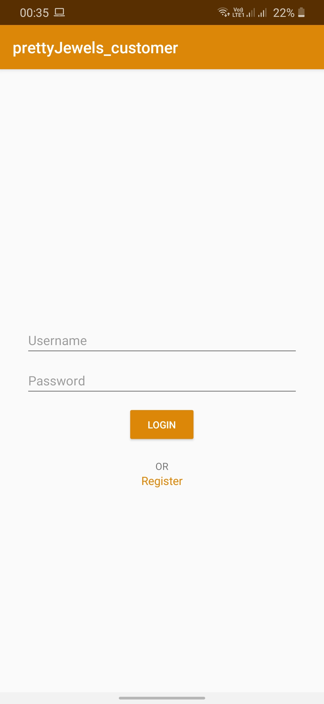
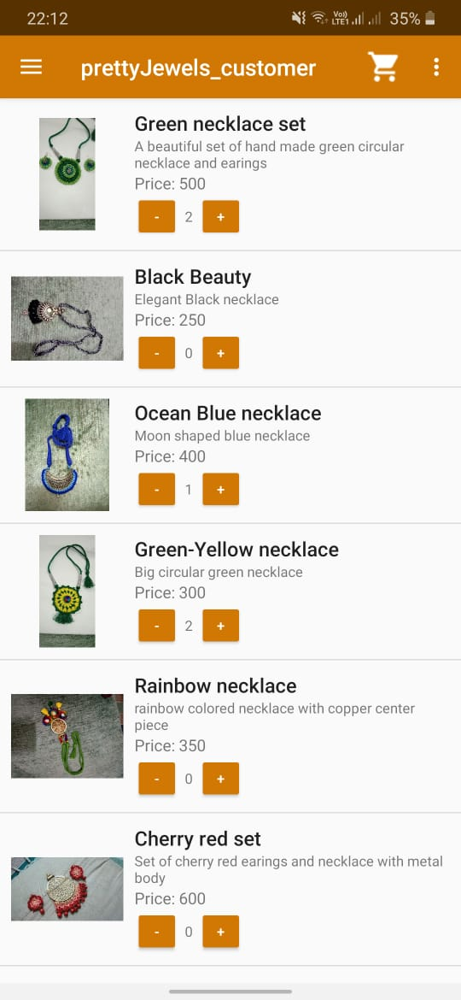
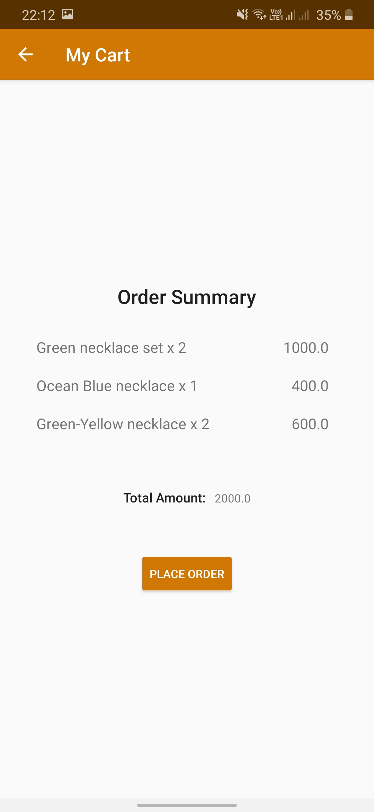
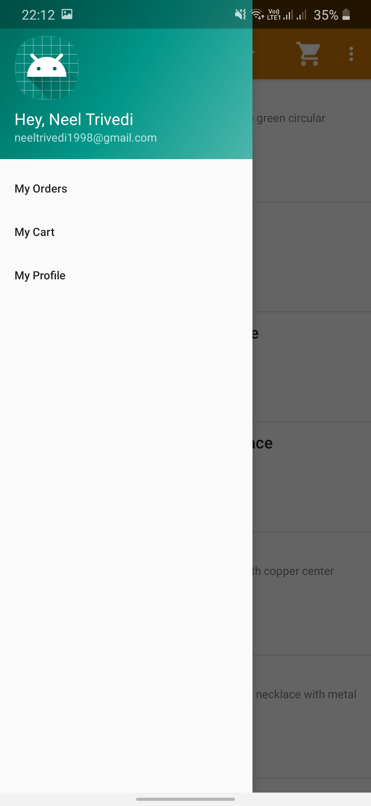
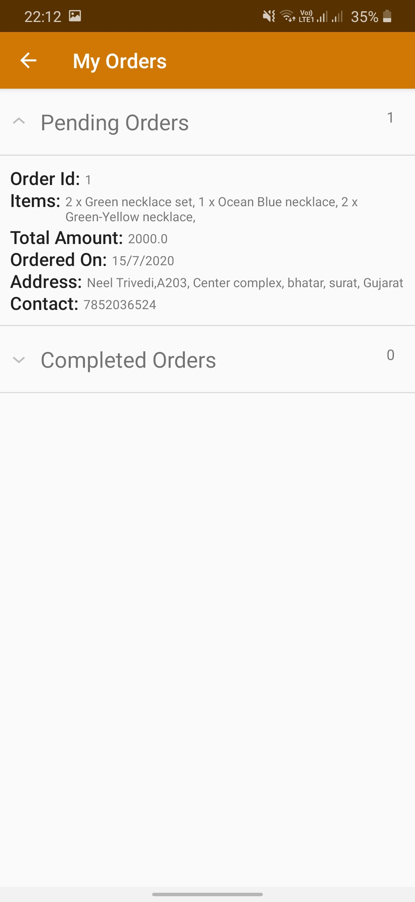

# Template Customer Android Application

As the part of the system created in [HomeBusinessMaker](https://github.com/rahul2805/HomeBusinessMaker) service, this repository contains the code for the template android application for the customer side of the business in the service.

### Main features of the Customer Android Application.

### Customer Register/ Login

New customers can easily register themselves to the application and use these credetials to login into the app. The login is implemented in persitent manner and hence one the owener has logged into the android application, he/she won't have to do it everytime the app is opened.

 

<hr/>

### Customer Home Page

Once the user logs into the customer android application, he can see the list of all the items added by the owner of this applciation. The customer android app is in sync with the web dashboard and the owner android application, hence any new addition of the items will be reflected in the customer android application. User can easily add the items to the cart similar to the almost all the e-commerce applcaitions out there.



<hr/>

### My Cart

Once user has selected the items he/she wishes to purchase, the summary of the order can by found in the my Cart tab and from here user can easily place the order. This placed order will be visible to owner in both web dashboard and owner android applciation.




### Orders Tab

Using the side navigation bar in the applciation, user can see the list of all the orders made in the past and their status.


 


<hr/>

### Setting up on your own system

To setup this applciation on your system, first follow the steps mentioned in the README of [HomeBusinessMaker](https://github.com/rahul2805/HomeBusinessMaker). After making these changes, update the ```mainPath``` variable of ```make_apk.sh``` script in the repository based on the installation location of this repo in your system.
